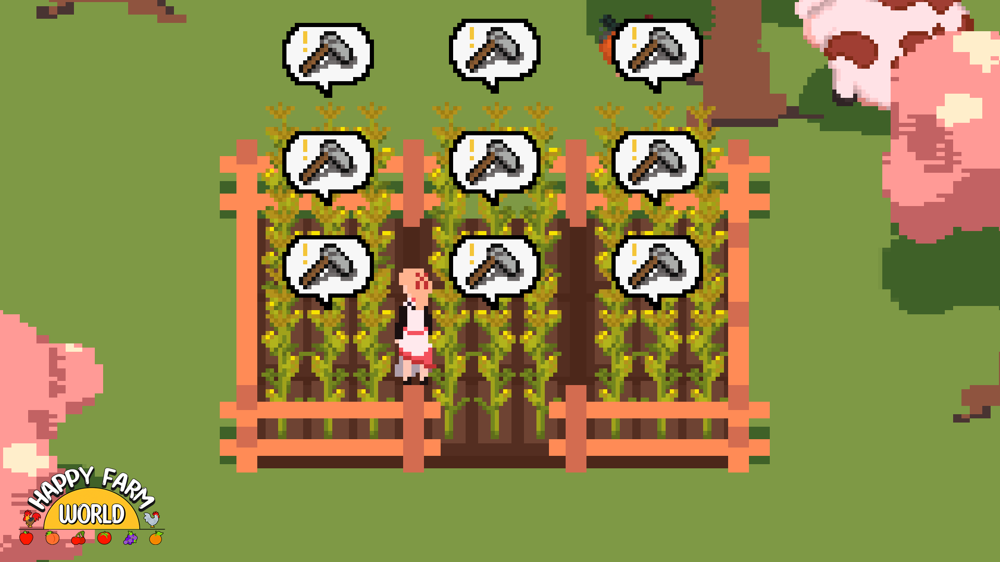
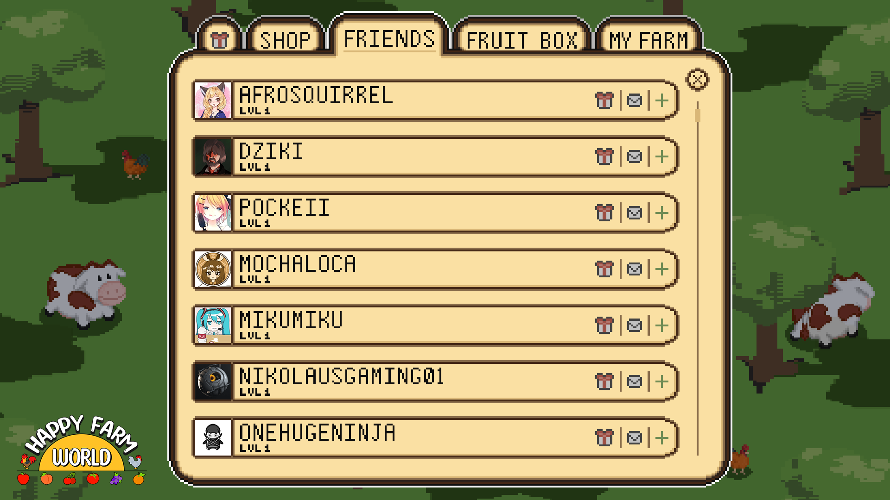

   Happy Farm World is an in development real-time farm simulation sandbox game which draws heavy inspiration from classic browser-based flash games.  

   Many modern games which approach the farming genre either focus heavily on a strict 1-to-1 simulation of farming or draw focus away from it with other gameplay systems, bogging down the experience. Happy Farm World avoids this by placing the farming gameplay loop front and center.  

REAL-TIME CROP GROWTH  
---------------------  

With real-time crop growth plant a fast growing crop for quick returns in *minutes*, or a slow growing set it and forget it crop and come back in a couple hours to stuff your coffers with a **bountiful** harvest. Level up crops for even higher payouts and turn around and use this profit to invest in your animal stock, seeds, decorations, or even the coveted Fruit Box!  

THERE'S LOOT BOXES??
--------------------  

YES! And no, you cannot pay with real money. Instead, use the farmcoins you earn from your crops and livestock and crack open a stray shipping box and the contents are yours! Nearly anything could be inside, new exotic seeds, otherworldly livestock, wacky decorations; you'll be in for a surprise *every time*. Speaking of surprises..  

RANDOM ENCOUNTERS!
------------------  

Every time you launch and play Happy Farm World you're liable to experience something few have seen, a random encounter! Be it a wandering neighbor, a lost calf, a golden goose, a giant carrot; *anything could happen*! What's more, you can share the good fortune with your friends!  

SHARING IS CARING
-----------------  

That's right! Have a calf wander your way? Let them foster one too! Have a goose lay a golden egg? Gift it to them and the joy will double! Invite your steam friends to your farm and work together to harvest and plant; when something special happens feel free to send a little something their way as thanks! Or just show off your *sick* decorating skills.  

STYLE FOR MILES
---------------  

Alright *moneybags*, you have *friends*, you have a *farm*, you have *loads* of *coin*, now what to do with it.. *Why decorate, of course!* Indulge in the finer things in life and fill your farm with pleasantries. Make more paths, fences, barns, silos, enclosures, ranchs, and do it **big**! Expand your land when you're high enough level and you'll have even more space for activities, farming, and so much more!!  

No more fishing, fighting, kissing, blighting, dealing with stalk market slighting.  
Just a *Happy Farm World*.
